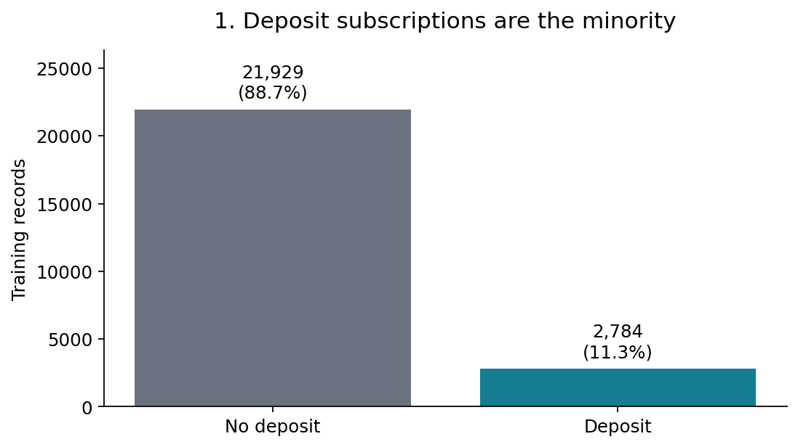
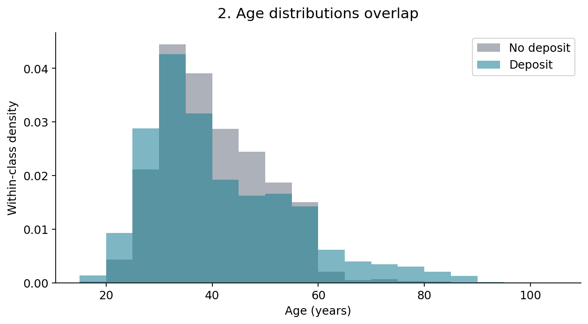
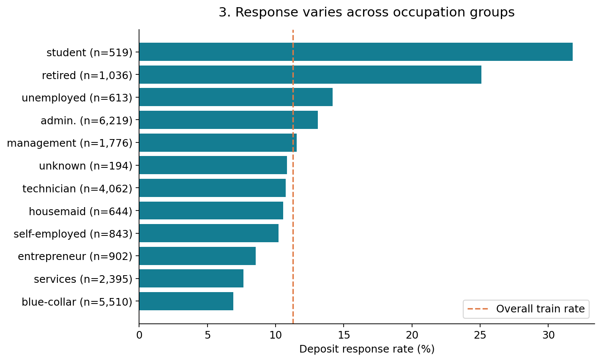
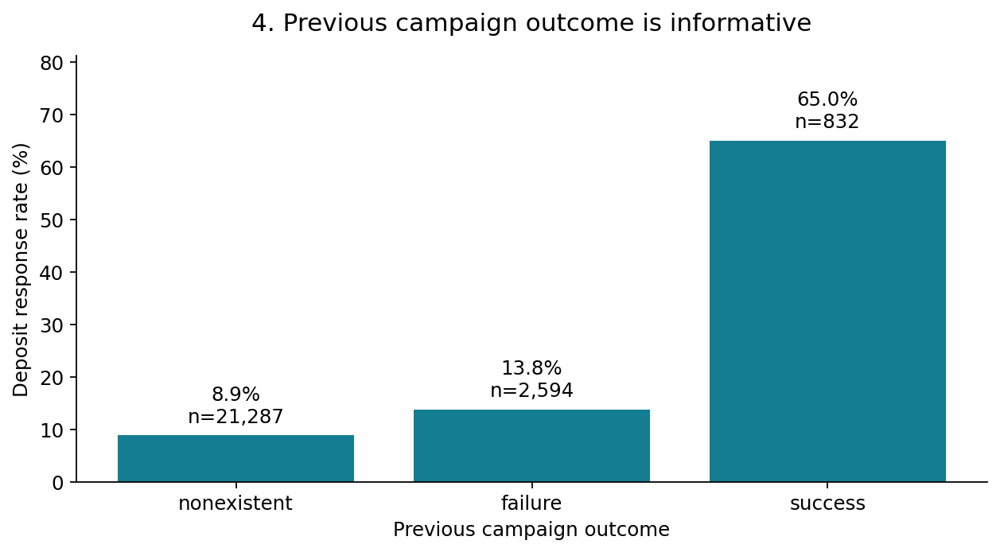
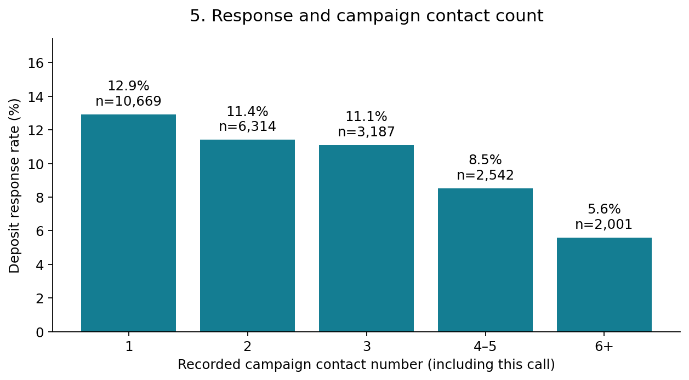
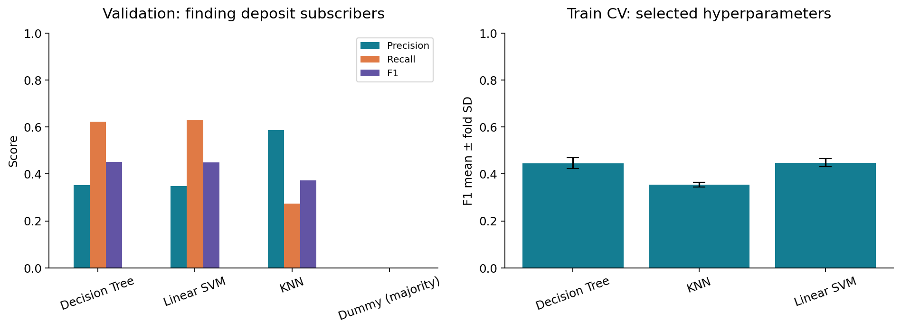
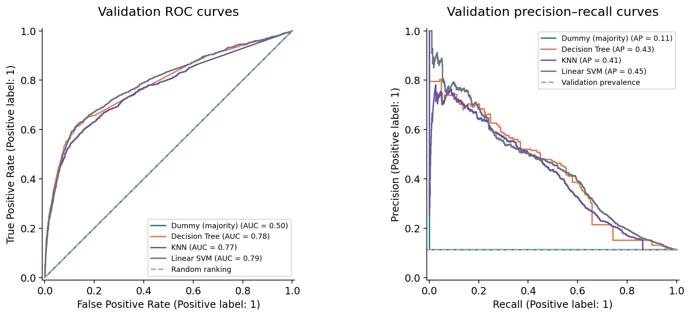
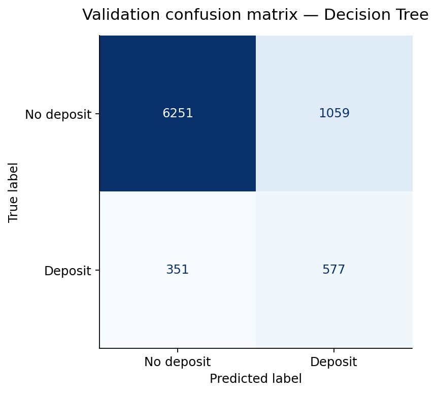
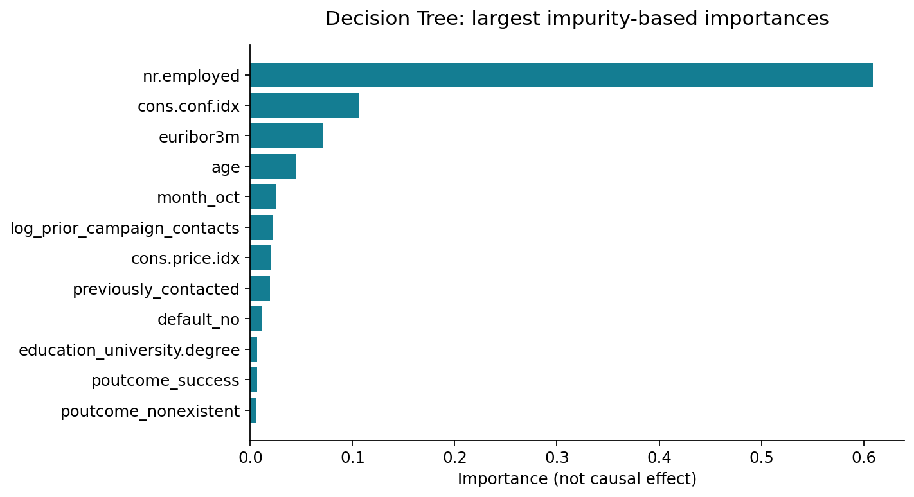

# Bank Marketing Response

**Machine Learning Algorithms · Midterm Project Report**

**Team:** Nurlan Ramazan · Araizhan Tazhimova

[Notebook](notebooks/bank_marketing.ipynb) · [Python source](src/bank_marketing.py) · [Presentation](presentation/bank_marketing_midterm_redesigned.pptx)

## 1. Introduction

**Project question:** Can client and campaign information available before a
scheduled phone call predict whether a client will subscribe to a term deposit?

This is a binary classification task: `y=yes` is the positive class and `y=no`
is the negative class. The intended application is to help prioritize marketing
contacts. The primary success criterion is an improvement in **positive-class F1**
over a majority-class baseline. Precision, recall, ROC-AUC and average precision
(AP) describe complementary aspects of performance.

## 2. Dataset

The project uses the official [UCI Bank Marketing dataset](https://archive.ics.uci.edu/dataset/222/bank+marketing),
specifically **bank-additional-full.csv**: **41,188 records,
20 input features and one target**. The observations describe telephone campaigns
at a Portuguese bank from May 2008 to November 2010. The dataset is licensed under
**CC BY 4.0**.

The original archive was downloaded from UCI; the full CSV was loaded using a
semicolon separator and retained unchanged. Loading includes a SHA-256 check,
schema inspection and a data-quality audit. No synthetic records are used.
[Source documentation and checksum](data/README.md).

| Feature group | Variables |
|---|---|
| Client | `age`, `job`, `marital`, `education`, `default`, `housing`, `loan` |
| Current contact | `contact`, `month`, `day_of_week`, `duration`, `campaign` |
| Previous campaign | `pdays`, `previous`, `poutcome` |
| Economic indicators | `emp.var.rate`, `cons.price.idx`, `cons.conf.idx`, `euribor3m`, `nr.employed` |
| Target | `y`: term-deposit subscription (`yes` / `no`) |

`duration` is excluded from modelling because it is known only after the call.
Rows are campaign observations; client IDs and complete timestamps are unavailable.
[Feature definitions](results/data_dictionary.csv).

## 3. Exploratory data analysis

All five EDA plots use the **training partition (24,713 records)**.
The associations describe this historical sample and do not establish causal effects.

### 3.1 Target distribution



Only **11.27%** of training observations are subscriptions.
Predicting `no` for everyone yields **88.73% accuracy**
on train but zero positive-class recall and F1. This imbalance makes accuracy
insufficient for model selection.

### 3.2 Age distribution



The age distributions overlap substantially, so age alone cannot separate the
outcomes. Each class is normalized separately; the vertical axis shows density,
not the probability of subscribing at a given age.

### 3.3 Occupation and response



Students have a **31.8%** response rate
(n=519), retired clients
**25.1%** (n=1,036),
and blue-collar clients **6.9%**
(n=5,510). Unequal group sizes and campaign
selection affect the interpretation. [Data](results/eda_job_rates.csv).

### 3.4 Previous campaign outcome



Previous campaign success is associated with a **65.0%**
response rate (n=832), compared with
**8.9%** when no previous campaign outcome
exists. This feature describes history preceding the current target.
[Data](results/eda_previous_campaign_rates.csv).

### 3.5 Campaign contact count



Response is **12.9%** at the first recorded contact
and **5.6%** at six or more contacts. Repeated
attempts may follow non-response; the association does not show that additional
calls reduce interest. The chart includes the current call; preprocessing
converts the counter to earlier contacts. [Data](results/eda_campaign_rates.csv).

## 4. Data cleaning and feature engineering

The training audit found no conventional null values, but six categorical
features contain explicit `unknown` values. Numeric types, plausible ranges,
month codes and weekday codes were checked. Plausible extreme values were retained.
The full source contains **12 exact repeated rows**;
after removing `duration`, **2,021
predictor rows repeat**. These observations were retained and grouped during splitting.
[Quality audit](results/training_data_quality.csv) · [Numeric ranges](results/training_numeric_summary.csv).

| Issue or feature | Treatment | Reason |
|---|---|---|
| `duration` | Exclude | Unavailable at the prediction time |
| Unknown categories | Keep `unknown` as an explicit category | Preserve observations with missing information |
| `pdays=999` | Create `previously_contacted`; replace sentinel with missingness and median-impute elapsed days | Separate no previous contact from a time interval |
| Contact counts | Apply `log1p(campaign - 1)` and `log1p(previous)` | Represent prior contacts and reduce skew |
| Categorical features | One-hot encoding; ignore unseen categories at prediction | Avoid an artificial numeric ordering |
| Numeric features | Standardize for KNN and Linear SVM | Make distances and margins comparable across scales |
| Repeated profiles | Keep identical input profiles in one partition and CV fold | Prevent exact-profile overlap |
| Dates | Retain month and weekday categories | Full dates cannot be reconstructed from the available fields |

Imputation, encoding and scaling are fitted inside each training fold through a
scikit-learn `Pipeline`. The target is never included among the inputs.

## 5. Evaluation design

| Partition | Records | Purpose |
|---|---:|---|
| Train | 24,713 | EDA, preprocessing, cross-validation and tuning |
| Validation | 8,238 | Model comparison and error analysis |
| Test | 8,237 | Reserved for the final stage; not scored at midterm |

The approximately **60/20/20** split uses `StratifiedGroupKFold` with fixed random
seeds. Groups are identical predictor profiles after excluding `duration`.
The same grouping is enforced in **five-fold cross-validation** on train.
[Partition assignments](results/split_manifest.csv) · [CV folds](results/cv_fold_manifest.csv).

Hyperparameters are selected by mean training-CV F1. Validation then compares the
selected candidates using their default decision rules. ROC-AUC and AP use
continuous scores; AP denotes average precision. No threshold is tuned on test.

## 6. Baseline and models

| Model | Configuration evaluated | Selected configuration |
|---|---|---|
| Majority baseline | Always predict the training majority class | Always `no` |
| Decision Tree | Depth 4/7/10; minimum leaf size 20/80; unweighted/balanced classes | Depth 10, minimum leaf 20, balanced classes |
| KNN | 15/31/61 neighbours; uniform/distance weighting | 15 neighbours, distance weighting |
| Linear SVM | C = 0.01/0.1/1; unweighted/balanced classes | C = 1, balanced classes |

All three lecture algorithms use the same five training folds. The tree requires
no scaling; KNN and Linear SVM use standardized numeric features.
[Selected parameters](results/best_parameters.json).

### 6.1 Cross-validation results

| Model | Mean CV F1 | Fold SD | Candidates | Folds |
| --- | --- | --- | --- | --- |
| Decision Tree | 0.4456 | 0.0227 | 12 | 5 |
| KNN | 0.3537 | 0.0100 | 6 | 5 |
| Linear SVM | 0.4479 | 0.0167 | 6 | 5 |

The standard deviation describes variation across folds, not a confidence
interval. These scores are used for tuning and therefore contain selection optimism.
[CV summary](results/cv_summary.csv).

### 6.2 Validation results

| Model | Accuracy | Precision (yes) | Recall (yes) | F1 (yes) | ROC-AUC | AP |
| --- | --- | --- | --- | --- | --- | --- |
| Decision Tree | 0.8288 | 0.3527 | 0.6218 | 0.4501 | 0.7837 | 0.4337 |
| Linear SVM | 0.8252 | 0.3478 | 0.6304 | 0.4483 | 0.7908 | 0.4487 |
| KNN | 0.8963 | 0.5853 | 0.2737 | 0.3730 | 0.7695 | 0.4140 |
| Dummy (majority) | 0.8874 | 0.0000 | 0.0000 | 0.0000 | 0.5000 | 0.1126 |

**Decision Tree** has the highest validation F1, but its advantage over Linear
SVM is only about **0.002**. This small difference does not establish meaningful
superiority. Linear SVM has higher ROC-AUC and AP, while KNN combines higher
precision with lower recall. [Measured metrics](results/metrics.csv).



The left panel compares validation precision, recall and F1. The right panel
shows mean training-CV F1 with fold standard deviations.



The ranking curves complement the fixed decision-rule metrics. The
precision–recall reference is the positive prevalence in validation.

## 7. Error analysis and model interpretation



The tree identifies **577** subscriptions and misses **351**,
with **1,059** false positives and **6,251** true negatives.
It finds **62.2%** of actual subscribers, while
**35.3%** of its positive predictions are correct.
This illustrates the trade-off between missed subscribers and unproductive contacts.
[Subgroup diagnostics](results/validation_subgroup_errors.csv).

| Model | Train F1 | Validation F1 | Train minus validation |
| --- | --- | --- | --- |
| Decision Tree | 0.4818 | 0.4501 | 0.0317 |
| Dummy (majority) | 0.0000 | 0.0000 | 0.0000 |
| KNN | 0.9724 | 0.3730 | 0.5994 |
| Linear SVM | 0.4504 | 0.4483 | 0.0021 |

KNN has the largest train/validation F1 gap. Its training queries include their
own neighbours, making the in-sample score particularly optimistic. The tree and
Linear SVM have smaller gaps. [Data](results/generalization_gap.csv).



`nr.employed` has the highest impurity-based importance in the fitted tree.
Correlated economic variables and split-selection bias limit this interpretation;
importance does not imply causation. [Data](results/tree_feature_importance.csv).

## 8. Conclusion

The three lecture models improve positive-class F1 over the majority baseline.
Decision Tree reaches **0.450 validation F1** and
**62.2% recall**, but its precision shows that
many positive predictions are incorrect. Decision Tree and Linear SVM remain
close candidates for the final stage.

## 9. Limitations and final-stage plan

The data represent one historical banking context. Random partitions mix periods,
so the results do not estimate performance on future campaigns. Grouping identical
profiles does not guarantee client-level separation without IDs. Availability and
publication lags of economic indicators cannot be verified. Validation was used
for model selection; an independent test estimate is still outstanding.

The final stage will:

1. Evaluate temporal stability on development data and audit feature availability.
2. Compare a nonlinear SVM and a wider, bounded hyperparameter search.
3. Select a decision threshold from development predictions using an explicit
   contact budget or error costs.
4. Examine subgroup errors and performance stability.
5. Freeze the pipeline and decision rule, then evaluate the reserved test once.

The current project measures prediction, not the causal effect of calling or
incremental profit. [Detailed final-stage plan](docs/FINAL_STAGE_PLAN.md).

## 10. Team roles

| Member | Proposed technical responsibility |
|---|---|
| Nurlan Ramazan | Data provenance, quality audit, preprocessing, feature engineering and leakage checks |
| Araizhan Tazhimova | EDA, model comparison, cross-validation, metrics and error analysis |
| Both | Interpretation, final-stage planning and presentation |

These are planned roles. Individual technical contributions remain to be
confirmed in the [team contribution log](docs/TEAM.md).

## 11. Reproduction

Tested with **Python 3.12.0**. From the project root on Windows:

```powershell
py -3.12 -m venv .venv
.\.venv\Scripts\python.exe -m pip install -r requirements.txt
.\.venv\Scripts\python.exe scripts/run_notebook.py
.\.venv\Scripts\python.exe scripts/validate_project.py
.\.venv\Scripts\python.exe scripts/build_reports.py
```

On macOS/Linux, use `python3 -m venv .venv` and `.venv/bin/python`.
The raw data are included. Exact dependencies are pinned in `requirements.txt`.
The saved notebook contains executed outputs; running it regenerates the results.
After editing `src/bank_marketing.py`, run `python scripts/sync_notebook.py` before
executing the notebook again.

[Verification record](results/verification.json) · [Full notebook report](results/notebook_report.html) · [Rubric mapping](docs/RUBRIC_CHECKLIST.md)

## References

- Moro, S., Rita, P., & Cortez, P. (2014). *Bank Marketing*. UCI Machine Learning Repository. [Dataset DOI](https://doi.org/10.24432/C5K306). CC BY 4.0.
- [Original feature documentation](data/raw/bank-additional-names.txt).
- Scikit-learn documentation: [preprocessing and leakage](https://scikit-learn.org/stable/common_pitfalls.html), [evaluation metrics](https://scikit-learn.org/stable/modules/model_evaluation.html), [cross-validation](https://scikit-learn.org/stable/modules/cross_validation.html).
